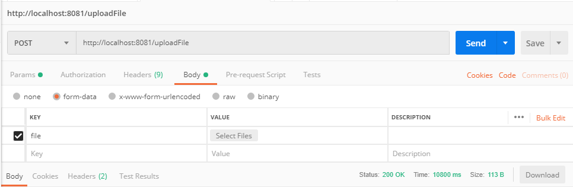

# Webflux-Streaming-Service

Video streaming implemented with Spring WebFLux.

> All videos should be placed in the video directory.

How to run:
-
- Clone the project
- create a video folder inside of the Project
- in your terminal `cd path/to/directory`
- run `./mvnw spring-boot:run` 
- to build a Docker image `clean package docker:build`
- or run `docker build -t dev/streaming:latest .` in the part target/docker

After the application finishes loading navigate to 
`http://localhost:8081/video/{name of video in videos directory}`

Upload video

